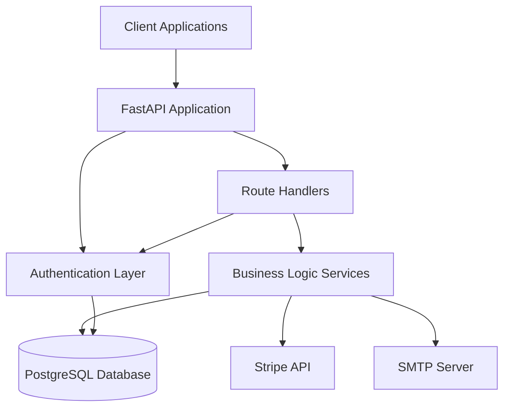
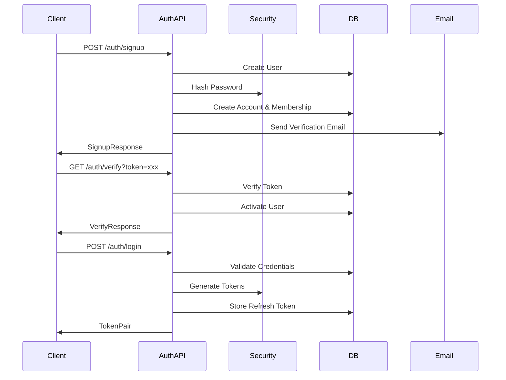
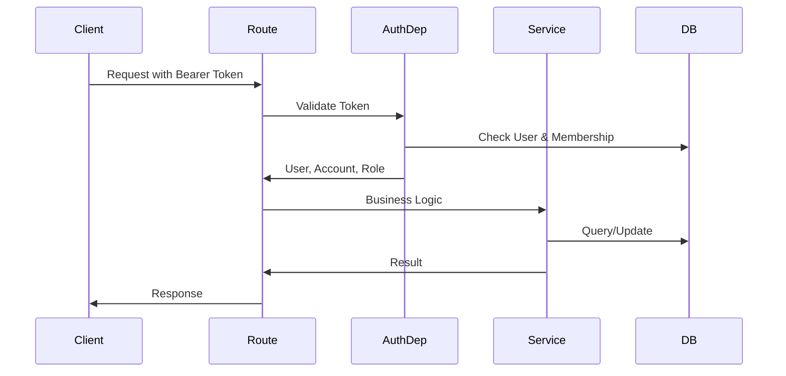
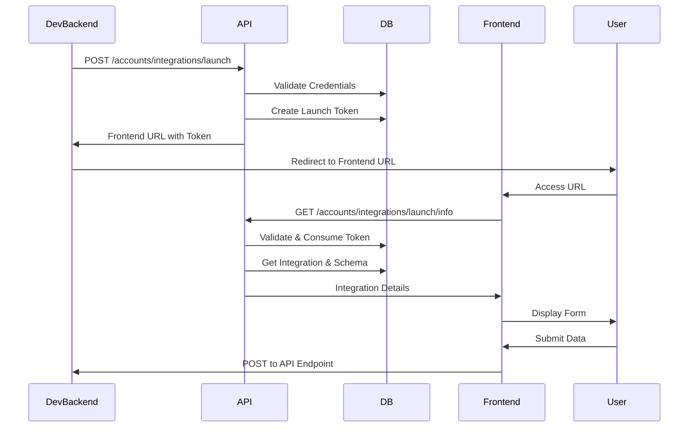
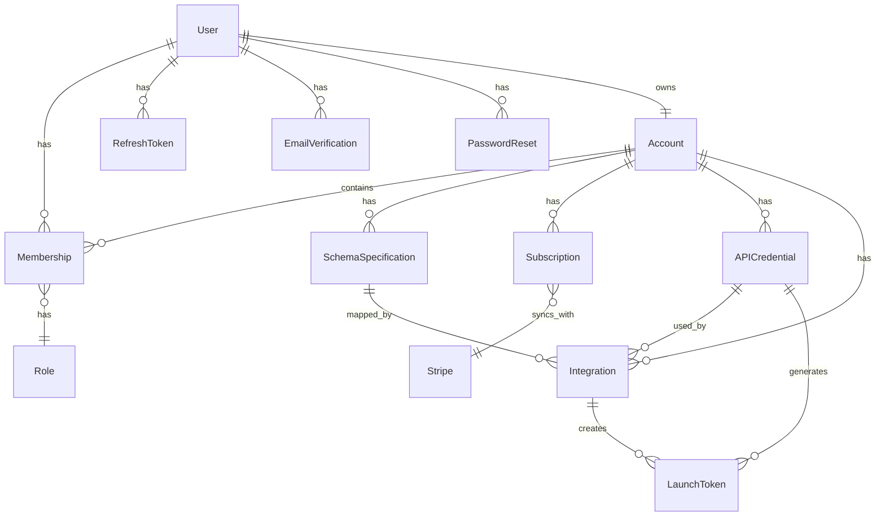

# SmartSchema Backend Architecture

This document provides an overview of the SmartSchema Backend architecture, including system design, request flows, and database relationships.

## System Overview

SmartSchema Backend is a RESTful API built with FastAPI that provides schema management, user authentication, subscription billing, and integration capabilities.

## High-Level Architecture



## Request Flow

### Authentication Flow



### API Request Flow (Authenticated)



### Integration Launch Flow



## Database Schema Relationships



## Component Architecture

### Application Layers

1. **API Layer** (`app/api/routes/`)
   - Route handlers for HTTP endpoints
   - Request/response validation via Pydantic schemas
   - Dependency injection for authentication and database

2. **Business Logic Layer** (`app/services/`)
   - Core business logic separated from routes
   - External service integrations (Stripe, Email)
   - Data processing (schema inference, type inference)

3. **Data Access Layer** (`app/models/`, `app/db/`)
   - SQLAlchemy ORM models
   - Database session management
   - Query abstraction

4. **Core Layer** (`app/core/`)
   - Configuration management
   - Security utilities (JWT, password hashing)
   - Shared dependencies

### Authentication & Authorization

**Authentication**:
- JWT-based authentication with access and refresh tokens
- Access tokens: Short-lived (15 minutes default)
- Refresh tokens: Long-lived (30 days default), stored in database
- Token rotation on refresh

**Authorization**:
- Role-based access control (RBAC)
- Roles: OWNER, ADMIN, MEMBER, VIEWER
- Path-based authorization via `require_role_for_account` dependency
- Per-schema permissions for MEMBER/VIEWER roles

### Multi-Tenancy

- Each user can belong to multiple accounts (via Memberships)
- Each account has one owner (User)
- Account-scoped resources (schemas, integrations, credentials)
- Cross-account data isolation enforced at route level

## Data Flow Examples

### Schema Creation Flow

```
1. Client → POST /accounts/{account_id}/schemas
2. Route validates: User is OWNER/ADMIN of account
3. Route creates SchemaSpecification model
4. Database stores schema JSON and validators
5. Response includes formatted schema with computed fields
```

### Subscription Checkout Flow

```
1. Client → POST /accounts/{account_id}/subscriptions/checkout
2. Route validates: User is OWNER
3. Service creates Stripe Checkout Session
4. Service creates/updates local Subscription record (status: pending)
5. Stripe redirects user to payment
6. Stripe webhook → POST /stripe/webhook
7. Webhook handler updates Subscription status
8. User redirected back to app
```

### Integration Launch Flow

```
1. Developer backend → POST /accounts/integrations/launch
   - Authenticates with client_id + client_secret
   - Creates LaunchToken (short-lived, single-use)
   - Returns frontend URL with token in fragment

2. Frontend → GET /accounts/integrations/launch/info
   - Extracts token from URL fragment
   - Validates token (not expired, not used)
   - Marks token as used
   - Returns integration details (schema, API endpoint, etc.)

3. User fills form → Frontend submits to developer's API endpoint
```

## Security Architecture

### Token Management

- **Access Tokens**: Stateless JWT, contains user_id, account_id, role
- **Refresh Tokens**: Stored in database with hash, jti (JWT ID), expiry
- **Launch Tokens**: Short-lived (5 minutes), single-use, stored in database
- **Email Verification Tokens**: Hashed, time-limited, single-use
- **Password Reset Tokens**: Hashed, time-limited, single-use

### Password Security

- Passwords hashed using Passlib with pbkdf2_sha256
- Password reset revokes all refresh tokens
- Password change requires current password verification

### API Security

- Bearer token authentication for protected endpoints
- CORS configured for specific origins
- Input validation via Pydantic schemas
- SQL injection prevention via SQLAlchemy ORM
- XSS prevention via proper content-type headers

## External Integrations

### Stripe Integration

- **Checkout Sessions**: Create subscription checkout
- **Billing Portal**: Manage subscriptions
- **Webhooks**: Handle subscription events (completed, updated, deleted, payment failed)
- **Idempotency**: Webhook events tracked to prevent duplicate processing

### Email Integration

- **SMTP**: Sends transactional emails (verification, password reset, invitations)
- **Templates**: HTML email templates for user-facing emails
- **Rate Limiting**: Cooldown periods for verification email resends

## Performance Considerations

### Database

- Indexes on foreign keys and frequently queried fields
- Soft deletes for schemas (deleted_at column)
- Connection pooling via SQLAlchemy
- Query optimization with eager loading where needed

### Caching Opportunities

- User profile caching (currently not implemented)
- Schema caching (currently not implemented)
- Subscription status caching (currently not implemented)

### Async Operations

- Currently synchronous (can be improved with async/await)
- Email sending is blocking (can be moved to background tasks)
- File processing is blocking (can be improved with async)

## Deployment Architecture

### Current Setup

- **Server**: FastAPI with Uvicorn
- **Database**: PostgreSQL
- **Deployment**: Vercel (configured via vercel.json)
- **Environment**: Environment variables via .env file

### Recommended Production Setup

- **Application Server**: Uvicorn with multiple workers
- **Reverse Proxy**: Nginx or Cloudflare
- **Database**: Managed PostgreSQL (e.g., AWS RDS, Supabase)
- **Caching**: Redis for sessions/tokens
- **Background Jobs**: Celery or similar for async tasks
- **Monitoring**: Application performance monitoring (APM)
- **Logging**: Centralized logging service

## File Structure

```
app/
├── api/
│   ├── routes/          # Route handlers
│   ├── deps.py          # Database dependencies
│   └── deps_auth.py     # Authentication dependencies
├── core/
│   ├── config.py        # Configuration
│   └── security.py      # Security utilities
├── db/
│   ├── base.py          # Base model
│   ├── session.py       # Database session
│   └── model_registry.py # Model registry for Alembic
├── models/              # SQLAlchemy models
├── schemas/             # Pydantic schemas
└── services/            # Business logic services
```

## Key Design Decisions

1. **Multi-tenant Architecture**: Account-based isolation allows users to belong to multiple organizations
2. **Role-Based Access Control**: Flexible permission system with per-schema granularity
3. **Soft Deletes**: Schemas use soft deletes to maintain referential integrity
4. **Token Rotation**: Refresh tokens rotate on use for security
5. **Stripe Webhooks**: Idempotent webhook processing prevents duplicate charges
6. **Schema Inference**: Automatic schema detection from files/SQL reduces manual work

## Future Architecture Considerations

- **Microservices**: Consider splitting into auth, schemas, integrations services
- **Event-Driven**: Add event bus for decoupled service communication
- **GraphQL**: Consider GraphQL API for flexible data fetching
- **Real-time**: WebSocket support for live updates
- **Multi-region**: Database replication and CDN for global users


