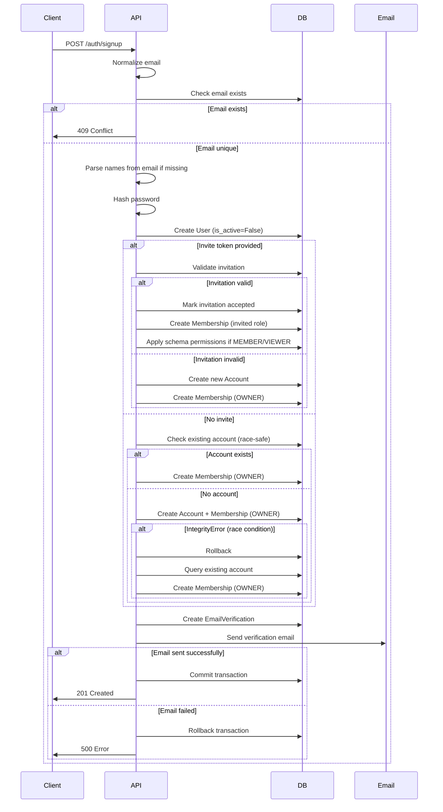

# Signup Flow Documentation

Detailed description of the user signup process in SmartSchema Backend.

## Endpoint

**POST** `/auth/signup`

## Overview

The signup endpoint creates a new user account and handles two scenarios:
1. **Invited User**: User signs up with an invitation token to join an existing account
2. **New User**: User signs up without invitation, creating a new personal workspace account

## Request Flow

### Step 1: Request Validation

**Input**: 
- `email`: User's email address (required)
- `password`: User's password, minimum 6 characters (required)
- `first_name`: User's first name (required)
- `last_name`: User's last name (required)
- `invite`: Optional invitation token string

**Validation**:
- Email format validated by Pydantic `EmailStr`
- Password length validated (min 6 characters)
- Name fields validated (1-80 characters, whitespace stripped)

### Step 2: Email Normalization

```python
email = body.email.lower().strip()
```

- Email converted to lowercase
- Leading/trailing whitespace removed
- Ensures consistent email storage format

### Step 3: Duplicate Email Check

```python
if db.query(User).filter(User.email == email).first():
    raise HTTPException(status_code=409, detail="Email is already registered.")
```

- Checks if email already exists in database
- Returns `409 Conflict` if email is already registered
- Prevents duplicate accounts

### Step 4: Name Processing

**If names provided**:
- Uses provided `first_name` and `last_name`

**If names missing**:
- Extracts names from email local-part using `parse_name_from_email()`
- Splits email on `.`, `_`, or `-` characters
- Capitalizes first part as `first_name`
- Capitalizes last part as `last_name`
- Example: `john.doe@example.com` → `first_name="John"`, `last_name="Doe"`

### Step 5: User Creation

```python
user = User(
    email=email,
    password_hash=hash_password(body.password),
    first_name=first_name,
    last_name=last_name,
    is_active=False,              # User cannot login until verified
    email_verified_at=None,       # Email not yet verified
)
db.add(user)
db.flush()  # Get user.id for subsequent operations
```

**User State**:
- `is_active=False`: User account is inactive
- `email_verified_at=None`: Email not verified
- Password hashed using PBKDF2-SHA256
- User ID generated (UUID)

### Step 6: Invitation Handling (If Invite Token Provided)

**Check Invitation**:
```python
if body.invite:
    inv = db.query(Invitation).filter(
        Invitation.token_hash == sha256(body.invite)
    ).first()
```

**Validate Invitation**:
- Token hash matched against database
- Invitation must exist
- `accepted_at` must be `None` (not already used)
- `expires_at` must be in the future (not expired)

**If Valid Invitation**:
- `account_id = inv.account_id` (join existing account)
- `role = inv.role` (use role from invitation)
- `inv.accepted_at = now_utc()` (mark invitation as accepted)

**If Invalid/No Invitation**:
- `account_id = None` (will create new account)
- `role = Role.MEMBER` (default, will be changed to OWNER)

### Step 7: Account Creation/Assignment

#### Scenario A: Invitation Accepted (account_id exists)

```python
if account_id is not None:
    # User joins existing account
    db.add(Membership(
        account_id=account_id,
        user_id=user.id,
        role=role  # From invitation (MEMBER, ADMIN, etc.)
    ))
```

- Creates membership linking user to existing account
- Role assigned from invitation

#### Scenario B: New Account Creation (account_id is None)

**Step 7.1: Check for Existing Account (Race Condition Protection)**

```python
existing_acc = db.query(Account).filter(
    Account.owner_user_id == user.id
).first()
```

- Checks if account already exists for this user
- Handles race condition where concurrent requests might create duplicate accounts

**Step 7.2a: Account Exists**

```python
if existing_acc:
    account_id = existing_acc.id
    # Ensure membership exists
    if not db.query(Membership).filter(...).first():
        db.add(Membership(
            account_id=account_id,
            user_id=user.id,
            role=Role.OWNER
        ))
```

- Reuses existing account
- Creates membership if it doesn't exist
- User becomes OWNER of their account

**Step 7.2b: Create New Account**

```python
else:
    base = (first_name or email.split("@")[0]).strip()
    acct = Account(
        name=f"{base}'s workspace",
        owner_user_id=user.id
    )
    try:
        db.add(acct)
        db.flush()
        account_id = acct.id
        db.add(Membership(
            account_id=account_id,
            user_id=user.id,
            role=Role.OWNER
        ))
    except IntegrityError:
        # Concurrent request created account
        db.rollback()
        existing_acc = db.query(Account).filter(...).first()
        if existing_acc:
            account_id = existing_acc.id
            # Create membership if needed
```

**Account Naming**:
- Uses `first_name` if available
- Falls back to email local-part (before @)
- Format: `"{name}'s workspace"`
- Example: `"John's workspace"` or `"johndoe's workspace"`

**Race Condition Handling**:
- If `IntegrityError` occurs (unique constraint violation)
- Rollback transaction
- Query for existing account
- Reuse existing account and create membership

### Step 8: Schema Permissions (Invited Users Only)

```python
if body.invite and inv and inv.manage_schema_ids:
    db.flush()
    mem = db.query(Membership).filter(...).first()
    if mem and mem.role in {Role.MEMBER, Role.VIEWER}:
        mem.manage_schema_ids = inv.manage_schema_ids
```

**If Invitation Has Schema Permissions**:
- Flush to ensure membership exists in database
- Retrieve membership record
- If role is MEMBER or VIEWER (not ADMIN/OWNER)
- Apply per-schema permissions from invitation
- `manage_schema_ids` is a JSONB array of schema UUIDs

**Note**: ADMIN and OWNER roles ignore `manage_schema_ids` (they have full access)

### Step 9: Email Verification

```python
try:
    issue_email_verification(db, user.id, email, first_name)
    db.commit()
except IntegrityError:
    db.rollback()
    raise HTTPException(500, "Could not create verification token.")
except Exception:
    db.rollback()
    raise HTTPException(500, "Failed to send verification email.")
```

**Email Verification Process**:
1. Creates `EmailVerification` record with:
   - `user_id`: Links to user
   - `token_hash`: SHA256 hash of verification token
   - `expires_at`: 24 hours from now (default)
   - `consumed_at`: None (not yet used)

2. Generates verification token (random, URL-safe base64)

3. Sends verification email containing:
   - Verification link with token
   - User's first name for personalization
   - Expiration information

**Error Handling**:
- `IntegrityError`: Token creation failed (database constraint)
- Other exceptions: Email sending failed
- Both cases: Transaction rolled back, user not created
- Returns `500 Internal Server Error`

### Step 10: Response

```python
return SignupResponse()
```

**Response** (201 Created):
```json
{
  "ok": true,
  "message": "Verification email sent. Please check your inbox."
}
```

## Complete Flow Diagram



## State After Signup

### User Record
- ✅ Created in database
- ❌ `is_active = False` (cannot login)
- ❌ `email_verified_at = None` (email not verified)
- ✅ Password hashed and stored

### Account & Membership
- ✅ Account created (if new user) or joined (if invited)
- ✅ Membership created with appropriate role
- ✅ Schema permissions applied (if invited as MEMBER/VIEWER)

### Email Verification
- ✅ Verification token created
- ✅ Verification email sent
- ⏳ Waiting for user to click verification link

## Next Steps for User

1. **Check Email**: User receives verification email
2. **Click Link**: User clicks verification link
3. **Verify Email**: GET `/auth/verify?token=...` endpoint verifies email
4. **Account Activated**: User can now login
5. **Login**: POST `/auth/login` to get access tokens

## Error Scenarios

### 409 Conflict - Email Already Registered
- **Cause**: Email already exists in database
- **User Action**: Use login endpoint or password reset

### 500 Error - Verification Token Creation Failed
- **Cause**: Database constraint violation
- **User Action**: Retry signup

### 500 Error - Email Sending Failed
- **Cause**: SMTP server unavailable or misconfigured
- **User Action**: Retry signup or contact support
- **Note**: User record may or may not be created (transaction rolled back)

## Security Considerations

1. **Email Uniqueness**: Enforced at database level
2. **Password Hashing**: PBKDF2-SHA256 (secure, slow)
3. **Token Security**: Verification tokens hashed before storage
4. **Account Isolation**: Race condition protection prevents duplicate accounts
5. **Invitation Validation**: Invitations checked for expiration and reuse
6. **Transaction Safety**: All-or-nothing transaction (rollback on error)

## Invitation Flow Details

### Valid Invitation
- Token hash matches database record
- `accepted_at` is `None` (not used)
- `expires_at` is in the future
- User joins account with role from invitation
- Schema permissions applied if provided

### Invalid Invitation
- Token not found → Treated as new user signup
- Already accepted → Treated as new user signup
- Expired → Treated as new user signup
- **Note**: Invalid invitations don't cause errors, user just creates new account

## Race Condition Handling

The signup process handles concurrent requests:

1. **Account Creation**: Unique constraint on `owner_user_id` prevents duplicates
2. **Error Handling**: `IntegrityError` caught, existing account reused
3. **Membership Check**: Verifies membership doesn't exist before creating
4. **Transaction Safety**: All operations in single transaction

This ensures:
- Only one account per user (owner)
- No duplicate memberships
- Consistent state even under concurrent load

## Example Flows

### Example 1: New User Signup

```
1. POST /auth/signup
   {
     "email": "john@example.com",
     "password": "secure123",
     "first_name": "John",
     "last_name": "Doe",
     "invite": null
   }

2. User created: is_active=False
3. Account created: "John's workspace"
4. Membership created: role=OWNER
5. Verification email sent
6. Response: 201 Created
```

### Example 2: Invited User Signup

```
1. POST /auth/signup
   {
     "email": "jane@example.com",
     "password": "secure123",
     "first_name": "Jane",
     "last_name": "Smith",
     "invite": "abc123..."
   }

2. Invitation validated: account_id=uuid, role=MEMBER
3. User created: is_active=False
4. Invitation marked as accepted
5. Membership created: role=MEMBER, schema_ids=[uuid1, uuid2]
6. Verification email sent
7. Response: 201 Created
```

### Example 3: Duplicate Email

```
1. POST /auth/signup
   {
     "email": "existing@example.com",
     ...
   }

2. Email check: Email exists
3. Response: 409 Conflict
   {
     "detail": "Email is already registered."
   }
```

## Key Functions Used

- `parse_name_from_email()`: Extracts names from email
- `hash_password()`: Hashes password securely
- `sha256()`: Hashes invitation token
- `ensure_aware()`: Ensures timezone-aware datetime
- `now_utc()`: Gets current UTC time
- `issue_email_verification()`: Creates and sends verification email

## Database Operations Summary

1. **Query**: Check email exists
2. **Insert**: Create User
3. **Query**: Check invitation (if provided)
4. **Update**: Mark invitation accepted (if valid)
5. **Query/Insert**: Account creation or reuse
6. **Insert**: Create Membership
7. **Update**: Apply schema permissions (if applicable)
8. **Insert**: Create EmailVerification
9. **Commit**: All changes committed together

All operations are atomic (single transaction).


